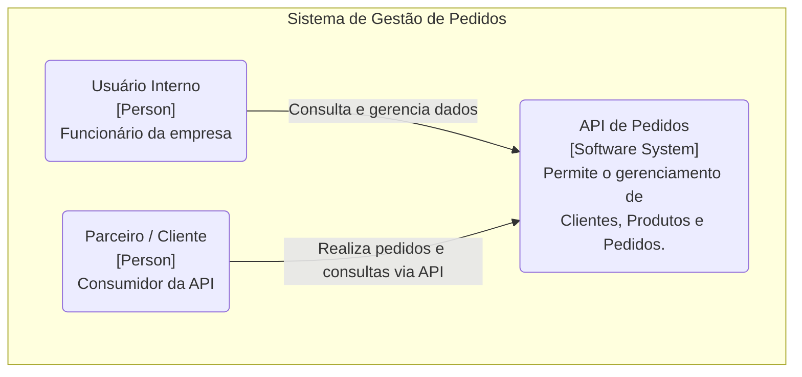
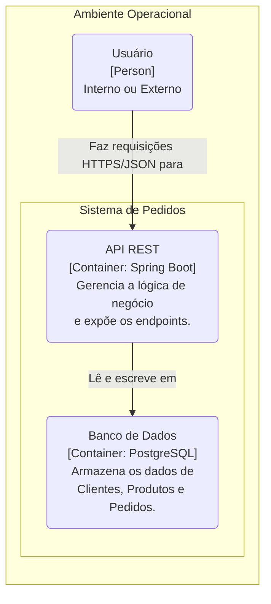
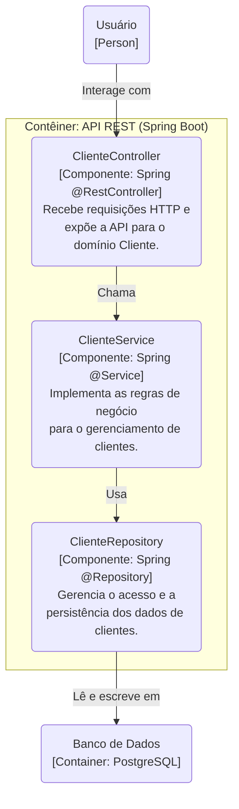
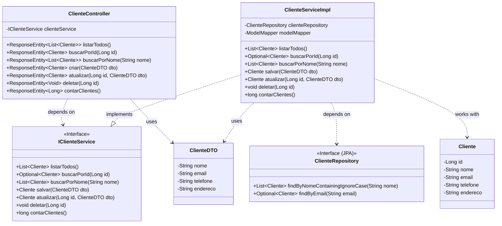
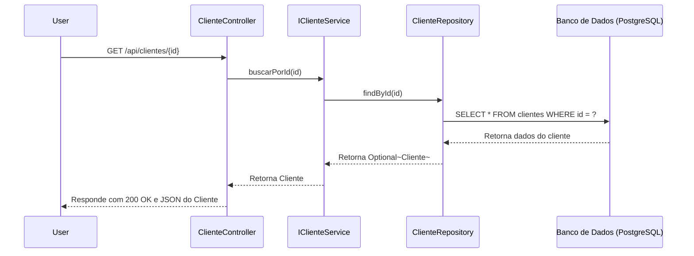

# Documento de Desenho Arquitetural - Sistema de Pedidos

## 1. Descritivo da Solução

A Solução deverá proporcionar acesso via API Rest para consulta, e manipulação de dados, para clientes internos e parceiros, dos domínios **"Cliente"**, **"Produto"** e **"Pedido"**.

---

### O Elemento "Cliente"

O Elemento "Cliente" deverá possuir as seguintes características, representando a entidade no banco de dados:

| Campo      | Tipo         | Descrição                                         |
| :--------- | :----------- | :------------------------------------------------ |
| `id`       | Long         | Representando o código sequencial do cliente.     |
| `nome`     | String       | Representando o nome do cliente.                  |
| `email`    | String       | Representando o email (único) do cliente.         |
| `telefone` | String       | Representando o telefone de contato do cliente.   |
| `endereco` | String       | Representando o endereço do cliente.              |

*Outros elementos como **Produto** e **Pedido** também possuem características próprias e endpoints dedicados.*

---

### API

A API deverá ser do tipo **RESTful** e deverá conter os seguintes métodos públicos expostos para o domínio **Cliente**:

-   **Path**: `/api/clientes`

-   **`listarTodos()`** = Lista todos os Clientes cadastrados
    -   verbo **GET** (`/`)

-   **`buscarPorNome(nome)`** = Lista os Clientes com similaridade de nome
    -   verbo **GET** (`/nome/{nome}`)

-   **`buscarPorId(id)`** = Retorna 1 Cliente com o ID indicado
    -   verbo **GET** (`/{id}`)

-   **`criar(clienteDTO)`** = Insere um novo cliente
    -   verbo **POST** (`/`)

-   **`atualizar(id, clienteDTO)`** = Atualiza um cliente existente
    -   verbo **PUT** (`/{id}`)

-   **`deletar(id)`** = Exclui um registro com o ID informado
    -   verbo **DELETE** (`/{id}`)

-   **`contarClientes()`** = Retorna a quantidade de registros cadastrados
    -   verbo **GET** (`/contar`)

---

### Persistência

A persistência será realizada por meio de um banco de dados relacional **PostgreSQL (versão 15)**, gerenciado via Docker. A conexão com a aplicação é feita através do seguinte JDBC:

`JDBC: jdbc:postgresql://localhost:5435/orders_db`

As migrações de schema do banco de dados são controladas pela ferramenta **Flyway**.

---

## 2. Estrutura de Pastas

A estrutura de pastas do projeto segue o padrão do Spring Boot, separando as responsabilidades em camadas bem definidas, conforme o padrão MVC.

```
src/main/java/com/br/bootcamp/orders/
├── OrdersApplication.java
├── model/
│   ├── Cliente.java
│   ├── Produto.java
│   ├── Pedido.java
│   ├── dto/
│   └── enums/
├── repository/
│   ├── ClienteRepository.java
│   ├── ProdutoRepository.java
│   └── PedidoRepository.java
├── service/
│   ├── contracts/
│   ├── exception/
│   ├── util/
│   ├── ClienteServiceImpl.java
│   ├── ProdutoServiceImpl.java
│   └── PedidoServiceImpl.java
└── controller/
    ├── config/
    ├── ClienteController.java
    ├── ProdutoController.java
    └── PedidoController.java
```

-   **`controller`** = Camada de Apresentação (View). Controla o fluxo das requisições HTTP, recebendo as chamadas e retornando as respostas.
-   **`service`** = Camada de Lógica de Negócio (Controller). Executa as regras de negócio, validações e orquestra as operações.
-   **`model`** = Camada de Modelo (Model). Contém as entidades de domínio (ex: `Cliente`, `Produto`), os DTOs para transferência de dados e os Enums.
-   **`repository`** = Camada de Acesso a Dados. Abstrai a comunicação com o banco de dados, provendo métodos para persistência das entidades.

---

## 3. Diagramas (C4 Model)

### C4 Model Nível 1: Diagrama de Contexto

Este diagrama apresenta uma visão geral do sistema, seus usuários e as interações de alto nível.



### C4 Model Nível 2: Diagrama de Contêineres

Este diagrama detalha os contêineres que compõem o sistema (aplicações e bancos de dados).



### C4 Model Nível 3: Diagrama de Componentes (Domínio Cliente)

Este diagrama foca nos componentes internos do contêiner da API, mostrando como as funcionalidades do domínio "Cliente" são implementadas.



### C4 Model Nível 4: Diagrama de Classes (Domínio Cliente)

Este diagrama mostra as principais classes envolvidas no domínio "Cliente" e seus relacionamentos.



### Diagrama de Sequência: Buscar Cliente por ID

Este diagrama ilustra a sequência de chamadas para a funcionalidade de busca de um cliente pelo seu ID.

