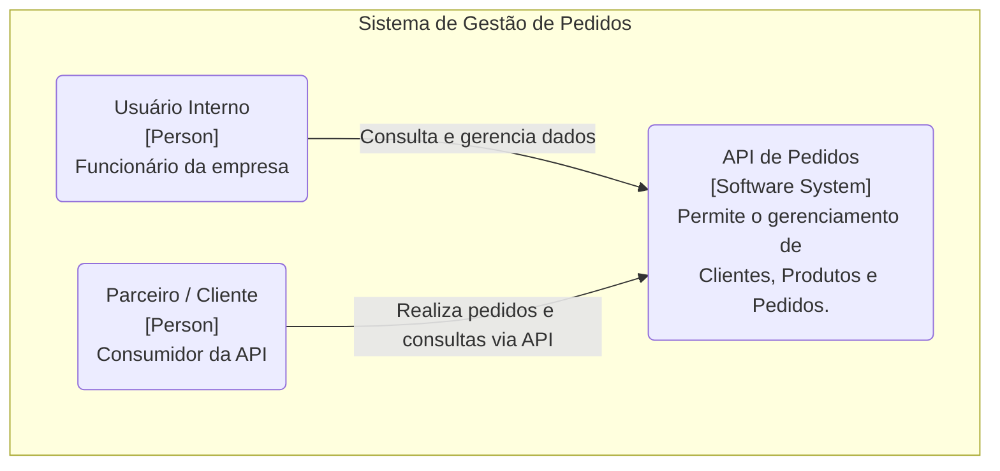
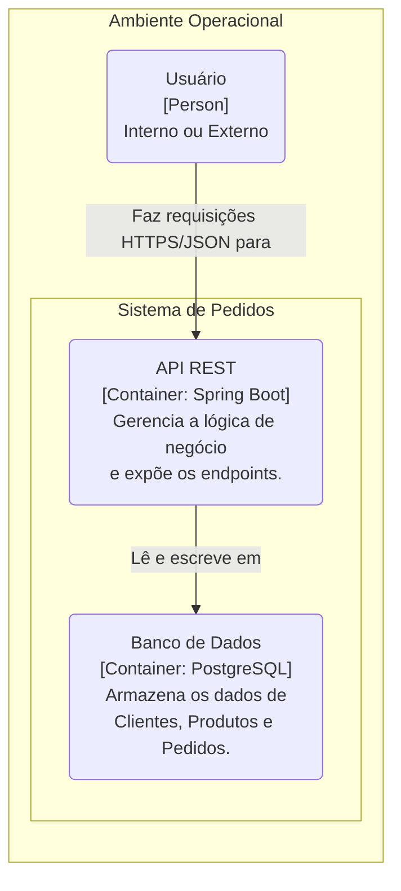
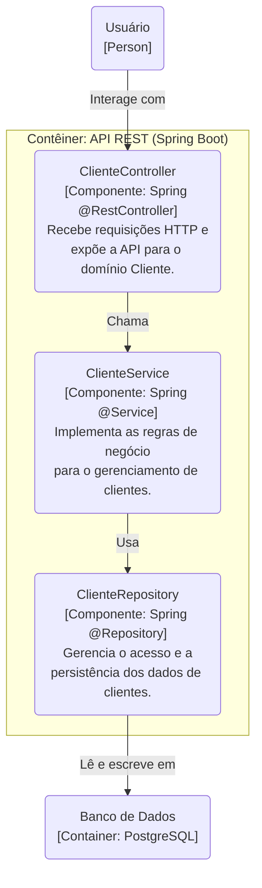
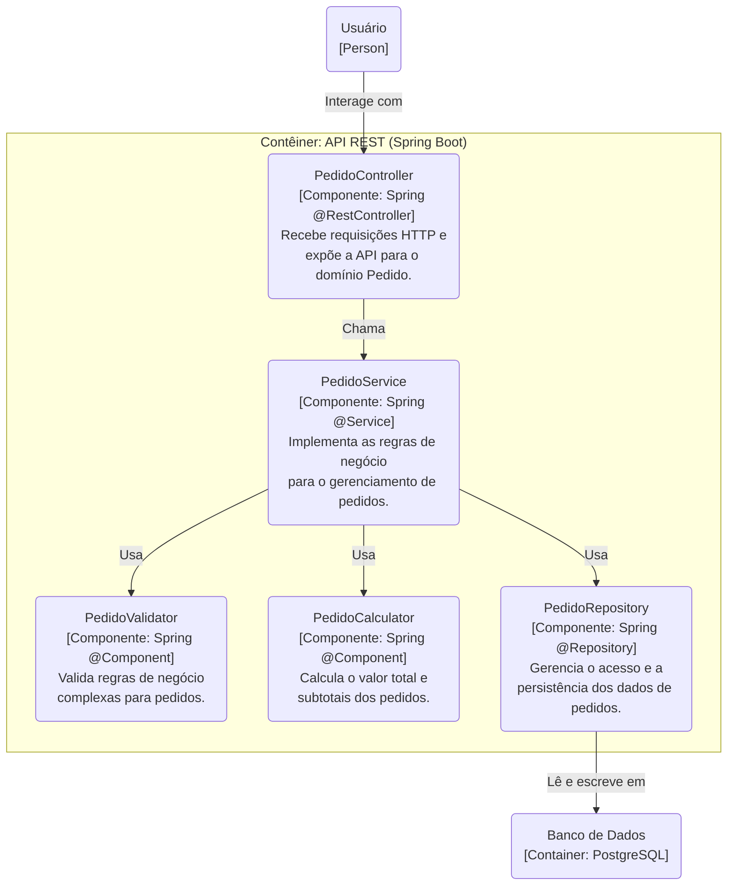

# Documento de Desenho Arquitetural - Sistema de Pedidos

**Repositório do Projeto:** [https://github.com/iagobrdev/orders-bootcamp](https://github.com/iagobrdev/orders-bootcamp)

## 1. Descritivo da Solução

A Solução deverá proporcionar acesso via API Rest para consulta, e manipulação de dados, para clientes internos e parceiros, dos domínios **"Cliente"**, **"Produto"** e **"Pedido"**.

---

### O Elemento "Cliente"

O Elemento "Cliente" deverá possuir as seguintes características, representando a entidade no banco de dados:

| Campo      | Tipo         | Descrição                                         |
| :--------- | :----------- | :------------------------------------------------ |
| `id`       | Long         | Representando o código sequencial do cliente.     |
| `nome`     | String       | Representando o nome do cliente.                  |
| `email`    | String       | Representando o email (único) do cliente.         |
| `telefone` | String       | Representando o telefone de contato do cliente.   |
| `endereco` | String       | Representando o endereço do cliente.              |

---

### O Elemento "Produto"

| Campo               | Tipo             | Descrição                                          |
| :------------------ | :--------------- | :------------------------------------------------- |
| `id`                | Long             | Representando o código sequencial do produto.      |
| `nome`              | String           | Representando o nome do produto.                   |
| `descricao`         | String           | Representando a descrição detalhada do produto.    |
| `preco`             | BigDecimal       | Representando o preço do produto.                  |
| `quantidadeEstoque` | Integer          | Representando a quantidade disponível em estoque.  |
| `categoria`         | CategoriaProduto | Representando a categoria do produto (Enum).       |

---

### O Elemento "Pedido"

| Campo         | Tipo            | Descrição                                           |
| :------------ | :-------------- | :-------------------------------------------------- |
| `id`          | Long            | Representando o código sequencial do pedido.        |
| `cliente`     | Cliente         | Representando o cliente que fez o pedido.           |
| `dataPedido`  | LocalDateTime   | Representando a data e hora em que o pedido foi feito. |
| `status`      | StatusPedido    | Representando o status atual do pedido (Enum).      |
| `tipoPagamento` | TipoPagamento   | Representando a forma de pagamento (Enum).          |
| `valorTotal`  | BigDecimal      | Representando o valor total calculado do pedido.    |
| `itens`       | List<ItemPedido> | Representando a lista de itens do pedido.          |

---

### API

A API deverá ser do tipo **RESTful** e deverá conter os seguintes métodos públicos expostos.

#### Endpoints de Clientes (`/api/clientes`)
-   **`listarTodos()`** = Lista todos os Clientes cadastrados
    -   verbo **GET** (`/`)
-   **`buscarPorNome(nome)`** = Lista os Clientes com similaridade de nome
    -   verbo **GET** (`/nome/{nome}`)
-   **`buscarPorId(id)`** = Retorna 1 Cliente com o ID indicado
    -   verbo **GET** (`/{id}`)
-   **`criar(clienteDTO)`** = Insere um novo cliente
    -   verbo **POST** (`/`)
-   **`atualizar(id, clienteDTO)`** = Atualiza um cliente existente
    -   verbo **PUT** (`/{id}`)
-   **`deletar(id)`** = Exclui um registro com o ID informado
    -   verbo **DELETE** (`/{id}`)
-   **`contarClientes()`** = Retorna a quantidade de registros cadastrados
    -   verbo **GET** (`/contar`)

#### Endpoints de Produtos (`/api/produtos`)
-   **`listarTodos()`** = Lista todos os Produtos cadastrados
    -   verbo **GET** (`/`)
-   **`buscarPorId(id)`** = Retorna 1 Produto com o ID indicado
    -   verbo **GET** (`/{id}`)
-   **`buscarPorNome(nome)`** = Lista os Produtos com similaridade de nome
    -   verbo **GET** (`/nome/{nome}`)
-   **`criar(produtoDTO)`** = Insere um novo produto
    -   verbo **POST** (`/`)
-   **`atualizar(id, produtoDTO)`** = Atualiza um produto existente
    -   verbo **PUT** (`/{id}`)
-   **`deletar(id)`** = Exclui um registro com o ID informado
    -   verbo **DELETE** (`/{id}`)
-   **`contarProdutos()`** = Retorna a quantidade de registros cadastrados
    -   verbo **GET** (`/contar`)

#### Endpoints de Pedidos (`/api/pedidos`)
-   **`listarTodos()`** = Lista todos os Pedidos cadastrados
    -   verbo **GET** (`/`)
-   **`buscarPorId(id)`** = Retorna 1 Pedido com o ID indicado
    -   verbo **GET** (`/{id}`)
-   **`buscarPorCliente(id)`** = Lista os Pedidos de um cliente específico
    -   verbo **GET** (`/cliente/{id}`)
-   **`buscarPorStatus(status)`** = Lista os Pedidos por status
    -   verbo **GET** (`/status/{status}`)
-   **`criar(pedidoDTO)`** = Insere um novo pedido
    -   verbo **POST** (`/`)
-   **`atualizar(id, pedidoDTO)`** = Atualiza um pedido existente
    -   verbo **PUT** (`/{id}`)
-   **`deletar(id)`** = Exclui um registro com o ID informado
    -   verbo **DELETE** (`/{id}`)
-   **`contarPedidos()`** = Retorna a quantidade de registros cadastrados
    -   verbo **GET** (`/contar`)

---

### Persistência

A persistência será realizada por meio de um banco de dados relacional **PostgreSQL (versão 15)**, gerenciado via Docker. A conexão com a aplicação é feita através do seguinte JDBC:

`JDBC: jdbc:postgresql://localhost:5435/orders_db`

As migrações de schema do banco de dados são controladas pela ferramenta **Flyway**.

---

## 2. Estrutura de Pastas

A estrutura de pastas do projeto segue o padrão do Spring Boot, separando as responsabilidades em camadas bem definidas, conforme o padrão MVC.

```
src/main/java/com/br/bootcamp/orders/
├── OrdersApplication.java
├── model/
│   ├── Cliente.java
│   ├── Produto.java
│   ├── Pedido.java
│   ├── dto/
│   └── enums/
├── repository/
│   ├── ClienteRepository.java
│   ├── ProdutoRepository.java
│   └── PedidoRepository.java
├── service/
│   ├── contracts/
│   ├── exception/
│   ├── util/
│   ├── ClienteServiceImpl.java
│   ├── ProdutoServiceImpl.java
│   └── PedidoServiceImpl.java
└── controller/
    ├── config/
    ├── ClienteController.java
    ├── ProdutoController.java
    └── PedidoController.java
```

-   **`controller`** = Camada de Apresentação (View). Controla o fluxo das requisições HTTP, recebendo as chamadas e retornando as respostas.
-   **`service`** = Camada de Lógica de Negócio (Controller). Executa as regras de negócio, validações e orquestra as operações.
-   **`model`** = Camada de Modelo (Model). Contém as entidades de domínio (ex: `Cliente`, `Produto`), os DTOs para transferência de dados e os Enums.
-   **`repository`** = Camada de Acesso a Dados. Abstrai a comunicação com o banco de dados, provendo métodos para persistência das entidades.

---

## 3. Diagramas (C4 Model)

### C4 Model Nível 1: Diagrama de Contexto

Este diagrama apresenta uma visão geral do sistema, seus usuários e as interações de alto nível.



### C4 Model Nível 2: Diagrama de Contêineres

Este diagrama detalha os contêineres que compõem o sistema (aplicações e bancos de dados).



### C4 Model Nível 3: Diagrama de Componentes (Domínio Cliente)

Este diagrama foca nos componentes internos do contêiner da API, mostrando como as funcionalidades do domínio "Cliente" são implementadas.



### C4 Model Nível 4: Diagrama de Classes

Este diagrama mostra as principais classes que compõem a solução, seus relacionamentos e a separação entre as camadas MVC.

```mermaid
classDiagram
    direction TB

    subgraph "Camada de Apresentação (Controller)"
        ClienteController
        ProdutoController
        PedidoController
    end

    subgraph "Camada de Serviço (Service)"
        IClienteService { <<Interface>> }
        ClienteServiceImpl
        IProdutoService { <<Interface>> }
        ProdutoServiceImpl
        IPedidoService { <<Interface>> }
        PedidoServiceImpl
    end

    subgraph "Camada de Repositório (Repository)"
        ClienteRepository { <<Interface>> }
        ProdutoRepository { <<Interface>> }
        PedidoRepository { <<Interface>> }
    end

    subgraph "Camada de Domínio (Model)"
        class Cliente {
          -Long id
          -String nome
          -String email
        }
        class Produto {
          -Long id
          -String nome
          -BigDecimal preco
        }
        class Pedido {
          -Long id
          -LocalDateTime dataPedido
          -BigDecimal valorTotal
        }
        class ItemPedido {
          -Long id
          -Integer quantidade
        }
    end

    ClienteController ..> IClienteService
    ProdutoController ..> IProdutoService
    PedidoController ..> IPedidoService

    ClienteServiceImpl ..|> IClienteService
    ProdutoServiceImpl ..|> IProdutoService
    PedidoServiceImpl ..|> IPedidoService

    ClienteServiceImpl ..> ClienteRepository
    ProdutoServiceImpl ..> ProdutoRepository
    PedidoServiceImpl ..> PedidoRepository
    PedidoServiceImpl ..> ClienteRepository : usa
    PedidoServiceImpl ..> ProdutoRepository : usa

    ClienteRepository --o Cliente
    ProdutoRepository --o Produto
    PedidoRepository --o Pedido

    Pedido "1" -- "1..*" ItemPedido : contém
    Cliente "1" -- "0..*" Pedido : faz
    Produto "1" -- "0..*" ItemPedido : compõe
```

### C4 Model Nível 3: Diagrama de Componentes (Domínio Produto)

Este diagrama foca nos componentes internos do contêiner da API para o domínio "Produto".


### C4 Model Nível 3: Diagrama de Componentes (Domínio Pedido)

Este diagrama foca nos componentes internos do contêiner da API para o domínio "Pedido", incluindo seus utilitários.



</rewritten_file>