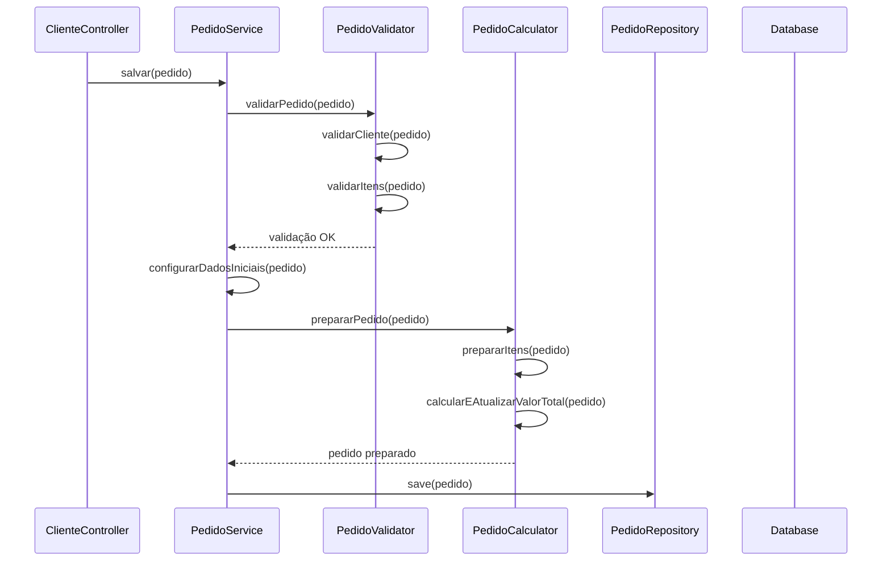

# Diagrama UML - Sistema de Pedidos

## 📋 Visão Geral

Este documento apresenta os diagramas UML do sistema de pedidos, incluindo as entidades, relacionamentos, atributos e métodos principais.

## 🏗️ Diagrama de Classes

### **Entidades Principais**

```mermaid
classDiagram
    class Cliente {
        -Long id
        -String nome
        -String email
        -String telefone
        -String endereco
        +Cliente()
        +Cliente(nome, email, telefone, endereco)
        +getters()
        +setters()
    }

    class Produto {
        -Long id
        -String nome
        -String descricao
        -BigDecimal preco
        -Integer quantidadeEstoque
        -CategoriaProduto categoria
        +Produto()
        +Produto(nome, descricao, preco, quantidadeEstoque, categoria)
        +getters()
        +setters()
    }

    class Pedido {
        -Long id
        -Cliente cliente
        -LocalDateTime dataPedido
        -StatusPedido status
        -TipoPagamento tipoPagamento
        -BigDecimal valorTotal
        -List~ItemPedido~ itens
        +Pedido()
        +Pedido(cliente, dataPedido, status, tipoPagamento, valorTotal)
        +getters()
        +setters()
    }

    class ItemPedido {
        -Long id
        -Pedido pedido
        -Produto produto
        -Integer quantidade
        -BigDecimal precoUnitario
        -BigDecimal subtotal
        +ItemPedido()
        +ItemPedido(pedido, produto, quantidade, precoUnitario, subtotal)
        +getters()
        +setters()
    }

    class StatusPedido {
        <<enumeration>>
        PENDENTE
        APROVADO
        EM_PREPARACAO
        ENVIADO
        ENTREGUE
        CANCELADO
        +String descricao
        +String detalhes
        +getDescricao()
        +getDetalhes()
        +permiteCancelamento()
        +isStatusFinal()
        +permiteAlteracao()
    }

    class CategoriaProduto {
        <<enumeration>>
        ELETRONICOS
        VESTUARIO
        CASA_DECORACAO
        BELEZA
        ESPORTES
        INFORMATICA
        ALIMENTACAO
        SAUDE
        INFANTIL
        AUTOMOTIVO
        JARDINAGEM
        LIVROS
        OUTROS
        +String descricao
        +String detalhes
        +getDescricao()
        +getDetalhes()
        +isCategoriaPrincipal()
        +isTecnologia()
        +isSaude()
    }

    class TipoPagamento {
        <<enumeration>>
        DINHEIRO
        CARTAO_CREDITO
        CARTAO_DEBITO
        PIX
        TRANSFERENCIA
        BOLETO
        CARTEIRA_DIGITAL
        VALE_REFEICAO
        VALE_ALIMENTACAO
        CUPOM
        OUTROS
        +String descricao
        +String detalhes
        +getDescricao()
        +getDetalhes()
        +isPagamentoDigital()
        +isPagamentoDinheiro()
        +isPagamentoCartao()
        +isPagamentoVale()
        +requerProcessamento()
    }

    %% Relacionamentos
    Cliente ||--o{ Pedido : "faz"
    Pedido ||--o{ ItemPedido : "contém"
    Produto ||--o{ ItemPedido : "incluído em"
    Pedido }o--|| StatusPedido : "tem"
    Pedido }o--|| TipoPagamento : "usa"
    Produto }o--|| CategoriaProduto : "pertence a"
```

## 🔗 Relacionamentos

### **1. Cliente → Pedido (1:N)**
- **Tipo**: One-to-Many
- **Descrição**: Um cliente pode fazer múltiplos pedidos
- **Mapeamento**: `@OneToMany(mappedBy = "cliente")`
- **Cascade**: ALL (remoção em cascata)

### **2. Pedido → ItemPedido (1:N)**
- **Tipo**: One-to-Many
- **Descrição**: Um pedido pode conter múltiplos itens
- **Mapeamento**: `@OneToMany(mappedBy = "pedido")`
- **Cascade**: ALL (remoção em cascata)

### **3. Produto → ItemPedido (1:N)**
- **Tipo**: One-to-Many
- **Descrição**: Um produto pode estar em múltiplos itens de pedido
- **Mapeamento**: `@OneToMany(mappedBy = "produto")`
- **Cascade**: ALL (remoção em cascata)

### **4. Pedido → StatusPedido (N:1)**
- **Tipo**: Many-to-One
- **Descrição**: Um pedido tem um status específico
- **Mapeamento**: `@Enumerated(EnumType.STRING)`

### **5. Pedido → TipoPagamento (N:1)**
- **Tipo**: Many-to-One
- **Descrição**: Um pedido usa um tipo de pagamento
- **Mapeamento**: `@Enumerated(EnumType.STRING)`

### **6. Produto → CategoriaProduto (N:1)**
- **Tipo**: Many-to-One
- **Descrição**: Um produto pertence a uma categoria
- **Mapeamento**: `@Enumerated(EnumType.STRING)`

## 📊 Atributos das Entidades

### **Cliente**
```java
@Entity
@Table(name = "clientes")
public class Cliente implements Serializable {
    @Id
    @GeneratedValue(strategy = GenerationType.IDENTITY)
    private Long id;
    
    @Column(nullable = false, length = 100)
    private String nome;
    
    @Column(nullable = false, unique = true, length = 100)
    private String email;
    
    @Column(length = 20)
    private String telefone;
    
    @Column(length = 200)
    private String endereco;
    
    @OneToMany(mappedBy = "cliente", cascade = CascadeType.ALL, fetch = FetchType.LAZY)
    private List<Pedido> pedidos;
}
```

### **Produto**
```java
@Entity
@Table(name = "produtos")
public class Produto implements Serializable {
    @Id
    @GeneratedValue(strategy = GenerationType.IDENTITY)
    private Long id;
    
    @Column(nullable = false, length = 100)
    private String nome;
    
    @Column(length = 500)
    private String descricao;
    
    @Column(nullable = false, precision = 10, scale = 2)
    private BigDecimal preco;
    
    @Column(nullable = false)
    private Integer quantidadeEstoque;
    
    @Enumerated(EnumType.STRING)
    @Column(length = 50)
    private CategoriaProduto categoria;
    
    @OneToMany(mappedBy = "produto", cascade = CascadeType.ALL, fetch = FetchType.LAZY)
    private List<ItemPedido> itensPedido;
}
```

### **Pedido**
```java
@Entity
@Table(name = "pedidos")
public class Pedido implements Serializable {
    @Id
    @GeneratedValue(strategy = GenerationType.IDENTITY)
    private Long id;
    
    @ManyToOne
    @JoinColumn(name = "cliente_id", nullable = false)
    private Cliente cliente;
    
    @Column(nullable = false)
    private LocalDateTime dataPedido;
    
    @Enumerated(EnumType.STRING)
    @Column(nullable = false)
    private StatusPedido status;
    
    @Enumerated(EnumType.STRING)
    @Column(nullable = false)
    private TipoPagamento tipoPagamento;
    
    @Column(nullable = false, precision = 10, scale = 2)
    private BigDecimal valorTotal;
    
    @OneToMany(mappedBy = "pedido", cascade = CascadeType.ALL, fetch = FetchType.LAZY)
    private List<ItemPedido> itens;
}
```

### **ItemPedido**
```java
@Entity
@Table(name = "itens_pedido")
public class ItemPedido implements Serializable {
    @Id
    @GeneratedValue(strategy = GenerationType.IDENTITY)
    private Long id;
    
    @ManyToOne
    @JoinColumn(name = "pedido_id", nullable = false)
    private Pedido pedido;
    
    @ManyToOne
    @JoinColumn(name = "produto_id", nullable = false)
    private Produto produto;
    
    @Column(nullable = false)
    private Integer quantidade;
    
    @Column(nullable = false, precision = 10, scale = 2)
    private BigDecimal precoUnitario;
    
    @Column(nullable = false, precision = 10, scale = 2)
    private BigDecimal subtotal;
}
```

## 🎯 Enums Centralizados

### **StatusPedido**
```java
public enum StatusPedido {
    PENDENTE("Pendente", "Pedido aguardando aprovação"),
    APROVADO("Aprovado", "Pedido aprovado pelo cliente"),
    EM_PREPARACAO("Em Preparação", "Produtos sendo preparados"),
    ENVIADO("Enviado", "Pedido enviado para entrega"),
    ENTREGUE("Entregue", "Pedido entregue ao cliente"),
    CANCELADO("Cancelado", "Pedido cancelado");
    
    // Métodos utilitários
    public boolean permiteCancelamento()
    public boolean isStatusFinal()
    public boolean permiteAlteracao()
}
```

### **CategoriaProduto**
```java
public enum CategoriaProduto {
    ELETRONICOS("Eletrônicos", "Produtos eletrônicos e tecnológicos"),
    VESTUARIO("Vestuário", "Roupas, calçados e acessórios"),
    CASA_DECORACAO("Casa e Decoração", "Produtos para casa e decoração"),
    // ... outras categorias
    
    // Métodos utilitários
    public boolean isCategoriaPrincipal()
    public boolean isTecnologia()
    public boolean isSaude()
}
```

### **TipoPagamento**
```java
public enum TipoPagamento {
    DINHEIRO("Dinheiro", "Pagamento em dinheiro"),
    CARTAO_CREDITO("Cartão de Crédito", "Pagamento com cartão de crédito"),
    PIX("PIX", "Pagamento via PIX"),
    // ... outros tipos
    
    // Métodos utilitários
    public boolean isPagamentoDigital()
    public boolean isPagamentoDinheiro()
    public boolean isPagamentoCartao()
    public boolean requerProcessamento()
}
```

## 🔄 Diagrama de Sequência - Criação de Pedido



## 🎯 Regras de Negócio

### **Cliente**
- Email deve ser único no sistema
- Nome e email são obrigatórios
- Um cliente pode ter múltiplos pedidos

### **Produto**
- Preço deve ser maior que zero
- Quantidade em estoque não pode ser negativa
- Um produto pode estar em múltiplos itens de pedido

### **Pedido**
- Deve ter um cliente associado
- Data do pedido é definida automaticamente
- Status inicial é sempre PENDENTE
- Valor total é calculado automaticamente

### **ItemPedido**
- Deve ter um pedido e um produto associados
- Quantidade deve ser maior que zero
- Preço unitário é copiado do produto
- Subtotal é calculado automaticamente

## 🔄 Ciclo de Vida do Pedido

```
PENDENTE → APROVADO → EM_PREPARACAO → ENVIADO → ENTREGUE
    ↓
CANCELADO
```

### **Transições de Status**
1. **PENDENTE**: Pedido criado, aguardando aprovação
2. **APROVADO**: Pedido aprovado, pode ser preparado
3. **EM_PREPARACAO**: Produtos sendo preparados
4. **ENVIADO**: Pedido enviado para entrega
5. **ENTREGUE**: Pedido entregue ao cliente
6. **CANCELADO**: Pedido cancelado (pode ocorrer a qualquer momento)

## 📊 Índices do Banco de Dados

### **Índices Primários**
- `clientes.id` (SERIAL PRIMARY KEY)
- `produtos.id` (SERIAL PRIMARY KEY)
- `pedidos.id` (SERIAL PRIMARY KEY)
- `itens_pedido.id` (SERIAL PRIMARY KEY)

### **Índices Secundários**
- `clientes.email` (UNIQUE)
- `pedidos.cliente_id` (FOREIGN KEY)
- `itens_pedido.pedido_id` (FOREIGN KEY)
- `itens_pedido.produto_id` (FOREIGN KEY)

## 🎨 Anotações JPA Utilizadas

### **Entidades**
- `@Entity`: Marca a classe como entidade JPA
- `@Table`: Define o nome da tabela no banco
- `@Id`: Marca o campo como chave primária
- `@GeneratedValue`: Define estratégia de geração de ID

### **Relacionamentos**
- `@OneToMany`: Relacionamento um-para-muitos
- `@ManyToOne`: Relacionamento muitos-para-um
- `@JoinColumn`: Define a coluna de junção
- `@MappedBy`: Define o campo que mapeia o relacionamento

### **Campos**
- `@Column`: Define propriedades da coluna
- `@Enumerated`: Define como enum é persistido
- `@Data`: Lombok - gera getters, setters, equals, hashCode
- `@NoArgsConstructor`: Lombok - construtor sem argumentos
- `@AllArgsConstructor`: Lombok - construtor com todos os argumentos 