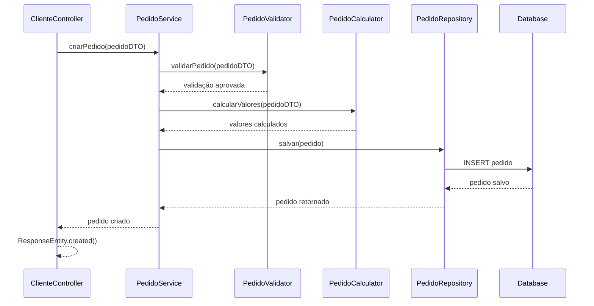
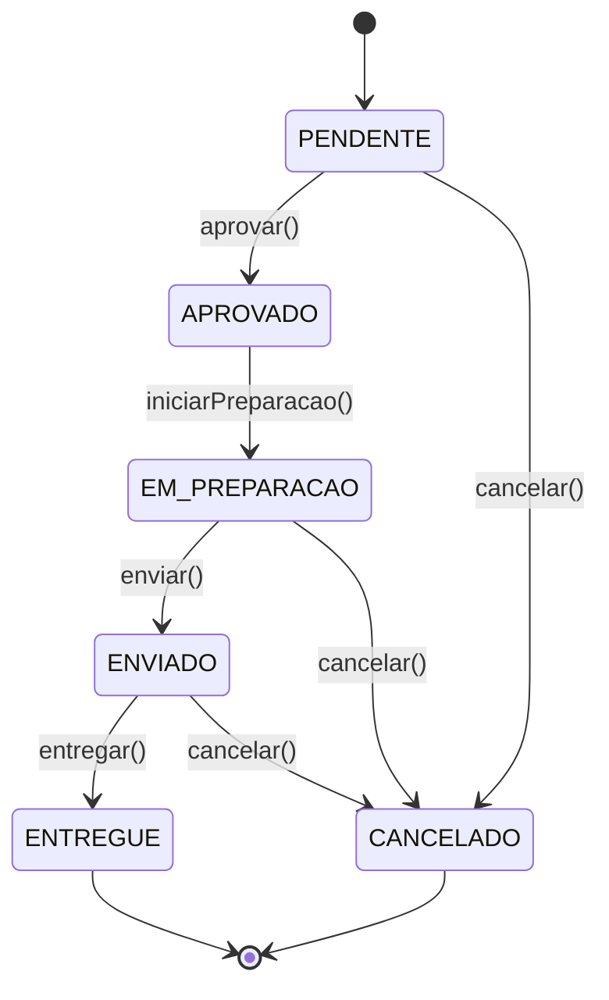
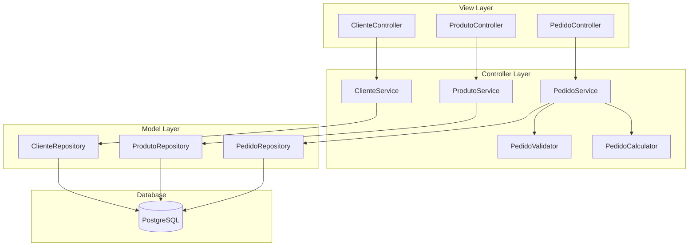

# Diagrama UML - Bootcamp Arquiteto(a) de Software

## 📋 Visão Geral

Este documento apresenta os **diagramas UML** do sistema desenvolvido como **Desafio Final** do Bootcamp de Arquiteto(a) de Software, demonstrando a aplicação prática dos conceitos de **Modelagem Arquitetural** e **Requisitos Arquiteturais**.

### 🎯 Objetivos de Ensino Demonstrados

1. **Fundamentos de Arquitetura de Software**: Separação clara de responsabilidades
2. **Requisitos Arquiteturais e Modelagem Arquitetural**: Diagramas UML completos
3. **Design Patterns, Estilos e Padrões Arquiteturais**: Padrões implementados
4. **Principais Arquiteturas de Software da Atualidade**: API RESTful com MVC

## 🏗️ Diagrama de Classes - Domínio Principal

### **Entidades Principais do Sistema**

```mermaid
classDiagram
    class Cliente {
        -Long id
        -String nome
        -String email
        -String telefone
        -String endereco
        +Cliente()
        +Cliente(nome, email, telefone, endereco)
        +getters()
        +setters()
    }

    class Produto {
        -Long id
        -String nome
        -String descricao
        -BigDecimal preco
        -Integer quantidadeEstoque
        -CategoriaProduto categoria
        +Produto()
        +Produto(nome, descricao, preco, quantidadeEstoque, categoria)
        +getters()
        +setters()
    }

    class Pedido {
        -Long id
        -Cliente cliente
        -LocalDateTime dataPedido
        -StatusPedido status
        -TipoPagamento tipoPagamento
        -BigDecimal valorTotal
        -List~ItemPedido~ itens
        +Pedido()
        +Pedido(cliente, dataPedido, status, tipoPagamento, valorTotal)
        +getters()
        +setters()
    }

    class ItemPedido {
        -Long id
        -Pedido pedido
        -Produto produto
        -Integer quantidade
        -BigDecimal precoUnitario
        -BigDecimal subtotal
        +ItemPedido()
        +ItemPedido(pedido, produto, quantidade, precoUnitario, subtotal)
        +getters()
        +setters()
    }

    class StatusPedido {
        <<enumeration>>
        PENDENTE
        APROVADO
        EM_PREPARACAO
        ENVIADO
        ENTREGUE
        CANCELADO
        +String descricao
        +String detalhes
        +getDescricao()
        +getDetalhes()
        +permiteCancelamento()
        +isStatusFinal()
        +permiteAlteracao()
    }

    class CategoriaProduto {
        <<enumeration>>
        ELETRONICOS
        VESTUARIO
        CASA_DECORACAO
        BELEZA
        ESPORTES
        INFORMATICA
        ALIMENTACAO
        SAUDE
        INFANTIL
        AUTOMOTIVO
        JARDINAGEM
        LIVROS
        OUTROS
        +String descricao
        +String detalhes
        +getDescricao()
        +getDetalhes()
        +isCategoriaPrincipal()
        +isTecnologia()
        +isSaude()
    }

    class TipoPagamento {
        <<enumeration>>
        DINHEIRO
        CARTAO_CREDITO
        CARTAO_DEBITO
        PIX
        TRANSFERENCIA
        BOLETO
        CARTEIRA_DIGITAL
        VALE_REFEICAO
        VALE_ALIMENTACAO
        CUPOM
        OUTROS
        +String descricao
        +String detalhes
        +getDescricao()
        +getDetalhes()
        +isPagamentoDigital()
        +isPagamentoDinheiro()
        +isPagamentoCartao()
        +isPagamentoVale()
        +requerProcessamento()
    }

    %% Relacionamentos
    Cliente ||--o{ Pedido : "faz"
    Pedido ||--o{ ItemPedido : "contém"
    Produto ||--o{ ItemPedido : "incluído em"
    Pedido }o--|| StatusPedido : "tem"
    Pedido }o--|| TipoPagamento : "usa"
    Produto }o--|| CategoriaProduto : "pertence a"
```

## 🔗 Relacionamentos Detalhados

### **1. Cliente → Pedido (1:N)**
- **Tipo**: One-to-Many
- **Descrição**: Um cliente pode fazer múltiplos pedidos
- **Mapeamento JPA**: `@OneToMany(mappedBy = "cliente")`
- **Cascade**: ALL (remoção em cascata)
- **Fetch**: LAZY (carregamento sob demanda)

### **2. Pedido → ItemPedido (1:N)**
- **Tipo**: One-to-Many
- **Descrição**: Um pedido pode conter múltiplos itens
- **Mapeamento JPA**: `@OneToMany(mappedBy = "pedido")`
- **Cascade**: ALL (remoção em cascata)
- **Fetch**: LAZY (carregamento sob demanda)

### **3. Produto → ItemPedido (1:N)**
- **Tipo**: One-to-Many
- **Descrição**: Um produto pode estar em múltiplos itens de pedido
- **Mapeamento JPA**: `@OneToMany(mappedBy = "produto")`
- **Cascade**: ALL (remoção em cascata)
- **Fetch**: LAZY (carregamento sob demanda)

### **4. Pedido → StatusPedido (N:1)**
- **Tipo**: Many-to-One
- **Descrição**: Um pedido tem um status específico
- **Mapeamento JPA**: `@Enumerated(EnumType.STRING)`
- **Validação**: Transições de status controladas

### **5. Pedido → TipoPagamento (N:1)**
- **Tipo**: Many-to-One
- **Descrição**: Um pedido usa um tipo de pagamento
- **Mapeamento JPA**: `@Enumerated(EnumType.STRING)`
- **Validação**: Tipos de pagamento válidos

### **6. Produto → CategoriaProduto (N:1)**
- **Tipo**: Many-to-One
- **Descrição**: Um produto pertence a uma categoria
- **Mapeamento JPA**: `@Enumerated(EnumType.STRING)`
- **Validação**: Categorias predefinidas

## 📊 Atributos das Entidades

### **Cliente**
```java
@Entity
@Table(name = "clientes")
public class Cliente implements Serializable {
    @Id
    @GeneratedValue(strategy = GenerationType.IDENTITY)
    private Long id;
    
    @Column(nullable = false, length = 100)
    private String nome;
    
    @Column(nullable = false, unique = true, length = 100)
    private String email;
    
    @Column(length = 20)
    private String telefone;
    
    @Column(length = 200)
    private String endereco;
    
    @OneToMany(mappedBy = "cliente", cascade = CascadeType.ALL, fetch = FetchType.LAZY)
    private List<Pedido> pedidos;
}
```

### **Produto**
```java
@Entity
@Table(name = "produtos")
public class Produto implements Serializable {
    @Id
    @GeneratedValue(strategy = GenerationType.IDENTITY)
    private Long id;
    
    @Column(nullable = false, length = 100)
    private String nome;
    
    @Column(nullable = false, length = 500)
    private String descricao;
    
    @Column(nullable = false, precision = 10, scale = 2)
    private BigDecimal preco;
    
    @Column(nullable = false)
    private Integer quantidadeEstoque;
    
    @Enumerated(EnumType.STRING)
    @Column(nullable = false)
    private CategoriaProduto categoria;
    
    @OneToMany(mappedBy = "produto", cascade = CascadeType.ALL, fetch = FetchType.LAZY)
    private List<ItemPedido> itensPedido;
}
```

### **Pedido**
```java
@Entity
@Table(name = "pedidos")
public class Pedido implements Serializable {
    @Id
    @GeneratedValue(strategy = GenerationType.IDENTITY)
    private Long id;
    
    @ManyToOne(fetch = FetchType.LAZY)
    @JoinColumn(name = "cliente_id", nullable = false)
    private Cliente cliente;
    
    @Column(nullable = false)
    private LocalDateTime dataPedido;
    
    @Enumerated(EnumType.STRING)
    @Column(nullable = false)
    private StatusPedido status;
    
    @Enumerated(EnumType.STRING)
    @Column(nullable = false)
    private TipoPagamento tipoPagamento;
    
    @Column(nullable = false, precision = 10, scale = 2)
    private BigDecimal valorTotal;
    
    @OneToMany(mappedBy = "pedido", cascade = CascadeType.ALL, fetch = FetchType.EAGER)
    private List<ItemPedido> itens;
}
```

### **ItemPedido**
```java
@Entity
@Table(name = "itens_pedido")
public class ItemPedido implements Serializable {
    @Id
    @GeneratedValue(strategy = GenerationType.IDENTITY)
    private Long id;
    
    @ManyToOne(fetch = FetchType.LAZY)
    @JoinColumn(name = "pedido_id", nullable = false)
    private Pedido pedido;
    
    @ManyToOne(fetch = FetchType.LAZY)
    @JoinColumn(name = "produto_id", nullable = false)
    private Produto produto;
    
    @Column(nullable = false)
    private Integer quantidade;
    
    @Column(nullable = false, precision = 10, scale = 2)
    private BigDecimal precoUnitario;
    
    @Column(nullable = false, precision = 10, scale = 2)
    private BigDecimal subtotal;
}
```

## 🎨 Padrões de Design Aplicados

### **1. Entity Pattern**
- **Objetivo**: Representar entidades de domínio
- **Implementação**: Classes anotadas com `@Entity`
- **Benefícios**: Mapeamento ORM, validações, relacionamentos

### **2. Enum Pattern**
- **Objetivo**: Valores constantes e tipados
- **Implementação**: Enums com métodos utilitários
- **Benefícios**: Type safety, validação, extensibilidade

### **3. Value Object Pattern**
- **Objetivo**: Objetos imutáveis para valores
- **Implementação**: `BigDecimal` para valores monetários
- **Benefícios**: Precisão, imutabilidade, validação

### **4. Aggregate Pattern**
- **Objetivo**: Agrupar entidades relacionadas
- **Implementação**: `Pedido` como raiz do agregado
- **Benefícios**: Consistência, transações, validações

## 🔐 Validações e Constraints

### **Constraints de Banco de Dados**
```sql
-- Cliente
ALTER TABLE clientes ADD CONSTRAINT uk_clientes_email UNIQUE (email);
ALTER TABLE clientes ADD CONSTRAINT ck_clientes_nome CHECK (nome IS NOT NULL AND LENGTH(nome) > 0);

-- Produto
ALTER TABLE produtos ADD CONSTRAINT ck_produtos_preco CHECK (preco > 0);
ALTER TABLE produtos ADD CONSTRAINT ck_produtos_estoque CHECK (quantidade_estoque >= 0);

-- Pedido
ALTER TABLE pedidos ADD CONSTRAINT ck_pedidos_valor_total CHECK (valor_total > 0);
ALTER TABLE pedidos ADD CONSTRAINT ck_pedidos_data_pedido CHECK (data_pedido IS NOT NULL);

-- ItemPedido
ALTER TABLE itens_pedido ADD CONSTRAINT ck_itens_quantidade CHECK (quantidade > 0);
ALTER TABLE itens_pedido ADD CONSTRAINT ck_itens_preco_unitario CHECK (preco_unitario > 0);
ALTER TABLE itens_pedido ADD CONSTRAINT ck_itens_subtotal CHECK (subtotal > 0);
```

### **Validações de Negócio**
- Email único por cliente
- Preços e quantidades positivos
- Estoque suficiente para pedidos
- Status de pedido válido
- Cálculo automático de subtotais

## 📈 Diagrama de Sequência - Criação de Pedido



## 🔄 Diagrama de Estados - Status do Pedido



## 📊 Diagrama de Componentes - Arquitetura MVC



## 🎯 Conclusão

Este diagrama UML demonstra a aplicação prática dos conceitos de **Modelagem Arquitetural** e **Requisitos Arquiteturais**, apresentando:

- **Diagrama de Classes**: Estrutura completa do domínio
- **Relacionamentos**: Mapeamentos JPA e constraints
- **Padrões de Design**: Aplicação de padrões arquiteturais
- **Validações**: Constraints de negócio e banco
- **Fluxos**: Diagramas de sequência e estados
- **Arquitetura**: Componentes MVC bem definidos

A modelagem atende aos requisitos do enunciado do bootcamp, demonstrando proficiência em arquitetura de software e modelagem UML. 